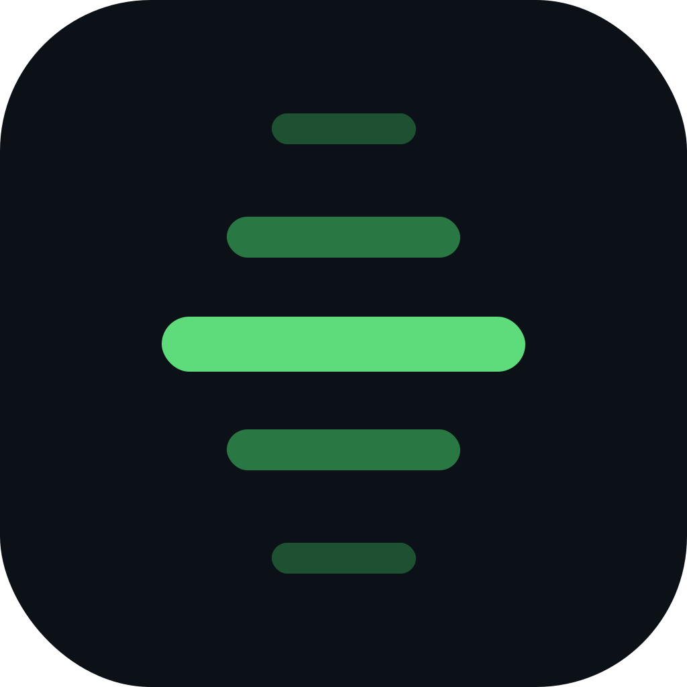
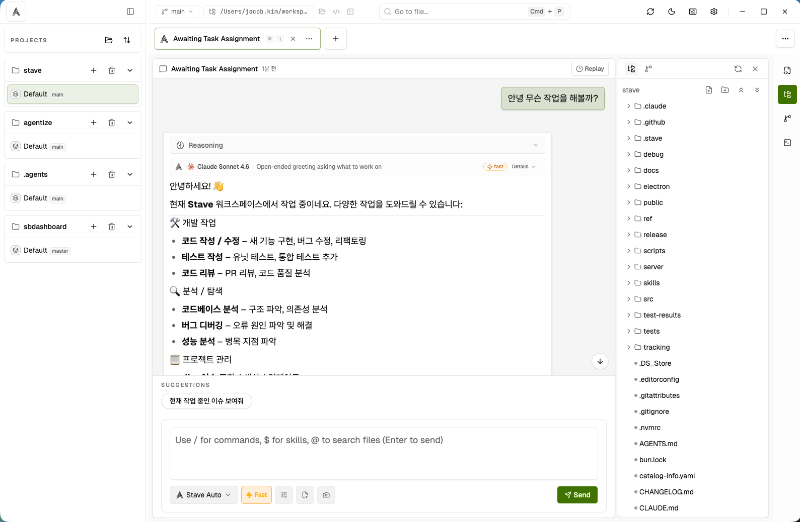

<div align="center">
  
</div>

# Stave

Stave is an Electron-based AI coding workspace built with Bun, React, Vite, and TypeScript.

**Website →** https://shiny-barnacle-5vmm96j.pages.github.io/



## Try Stave on macOS

If you already have GitHub CLI authenticated for `sendbird-playground`, install the latest internal macOS build with one command:

```bash
gh api -H 'Accept: application/vnd.github.v3.raw+json' repos/sendbird-playground/stave/contents/scripts/install-latest-release.sh | bash
```

To enable automatic daily updates (macOS LaunchAgent):

```bash
gh api -H 'Accept: application/vnd.github.v3.raw+json' repos/sendbird-playground/stave/contents/scripts/setup-auto-update.sh | bash
```

If this is your first time using `gh`, or you need SSO/scope troubleshooting, see the full [Install Guide](docs/install-guide.md).

## Highlights

- desktop-first Claude and Codex workspace
- task-oriented chat with approvals, user-input, tools, diffs, and plans
- task-local prompt history navigation in the composer via `ArrowUp` / `ArrowDown`
- global command palette on `Cmd/Ctrl+Shift+P` for IDE actions, separate from chat slash commands
- Session Replay drawer for recent-turn inspection and request snapshots
- `$skill-name` composer selector that resolves installed Claude and Codex skills across global, user, and workspace scopes
- file and image attachments in the composer, including screenshot capture and clipboard image paste with inline preview
- Monaco editor with workspace-backed TypeScript IntelliSense, optional LSP-backed TypeScript/JavaScript and Python support, docked terminal, and source-control actions
- always-visible top-bar quick open for searching workspace files, with `Cmd/Ctrl+P` focusing it
- generated repo-map cache with background pre-warming for first-turn codebase context injection
- redesigned project, workspace, and task shell with a collapsible project sidebar, workspace task tabs, and a right-side activity rail
- right-rail automation manager for shared workspace actions, services, and lifecycle hooks without a full JSON editor
- workspace-scoped information panel for Jira, Figma, Confluence, and Slack links, PR references, notes, todos, saved plans, and custom structured fields
- top-bar notification center with durable read/unread history for task completions and approval requests
- built-in light/dark modes, curated theme presets, and user-installable custom theme JSON support
- recent-project switching that preserves each project's own workspace list and last active workspace
- automatic import of existing branch-backed git worktrees when a project opens
- optional repo-scoped post-create workspace bootstrap command for new git worktrees, such as `bun install` or `npm install`
- optional repo-scoped reuse of the repository root `node_modules` via workspace-local symlink for faster worktree startup
- local-only packaged-app MCP automation surface for same-machine bots and helpers, with loopback HTTP plus a manifest-advertised stdio proxy for Codex-style hosts, Settings-managed port/token control, and a separate inbound request log
- SQLite-backed local persistence for projects, workspaces, tasks, messages, turns, and notifications

## Stack

- Bun
- TypeScript
- React 19 + Vite
- Electron + electron-vite
- Tailwind CSS v4
- Monaco Editor
- SQLite via `better-sqlite3`
- Playwright

## Future Data Roadmap

Stave's near-term local data direction is:

- `SQLite` for durable application state such as projects, workspaces, tasks, messages, and turns
- In-memory `Map` caches for repo-map context, formatted first-turn text, and other read-heavy renderer-side data (no persistence needed — caches are pre-warmed on workspace load)
- `LanceDB` as a future semantic retrieval layer if embedding-backed code/doc search becomes necessary
- `DuckDB` as a future local analytics engine for audit-log analysis, usage statistics, and heavier aggregate queries

The intent is to keep storage simple and avoid over-engineering for small data volumes. Repo-map context is 2-4 KB per workspace; an in-memory Map is sufficient.

## Roadmap

- Native Codex plan-mode parity: Stave currently ships an experimental Codex
  plan toggle on top of the TypeScript SDK exec stream. Promote this to
  first-class support when the SDK or transport exposes stable plan items and
  plan deltas. See [docs/future/codex-native-plan-mode-roadmap-2026-03-31.md](docs/future/codex-native-plan-mode-roadmap-2026-03-31.md).

## Prerequisites

- **Bun** — package manager and script runner
- **Node.js ≥ 20** (Node 22 LTS recommended — see `.nvmrc`). The project pins a version in `.nvmrc`; if you use `nvm` just run `nvm use` after cloning.
- **C++ build toolchain** — required for compiling `better-sqlite3` and `node-pty` native modules:
  - macOS: Xcode Command Line Tools (`xcode-select --install`)
  - Linux: `build-essential` (`sudo apt install build-essential`)
  - Windows: Visual Studio Build Tools 2022 with the **Desktop development with C++** workload (VC++ tools) and Python installed. See the [node-gyp Windows docs](https://github.com/nodejs/node-gyp#on-windows) for details. Example with Chocolatey:
    - `choco install visualstudio2022buildtools python --package-parameters "--add Microsoft.VisualStudio.Workload.VCTools --includeRecommended"`
- a working `claude` CLI login if you want Claude support
- a working `codex` CLI login if you want Codex support
- `typescript-language-server` on your PATH if you want optional TypeScript/JavaScript LSP support in the editor
- `pyright-langserver` or `basedpyright-langserver` on your PATH if you want Python LSP support in the editor

Typical auth commands:

```bash
claude auth login
codex login
```

## Install

```bash
bun install
```

`bun install` automatically runs a `postinstall` hook that patches `better-sqlite3` for Electron 41 compatibility and recompiles both `better-sqlite3` and `node-pty` against the Electron ABI. This is required because these native modules must be compiled for Electron's internal Node runtime, not the host Node version.

If you need to skip the native rebuild (e.g. in a CI environment that only runs web builds), set `SKIP_ELECTRON_REBUILD=1`:

```bash
SKIP_ELECTRON_REBUILD=1 bun install
```

## Development

```bash
# Web renderer only
bun run dev

# Browser renderer + local dev bridge server
bun run dev:all

# Electron desktop app
bun run dev:desktop

# Electron desktop app with polling file watching
bun run dev:desktop:poll
```

## Common scripts

- `bun run typecheck`
- `bun run test`
- `bun run test:e2e`
- `bun run test:ci`
- `bun run build`
- `bun run build:desktop`
- `bun run package:desktop`
- `bun run run:desktop:built`
- `bun run package:linux:dir`
- `bun run package:linux:appimage`
- `bun run package:linux:deb`

## Running the desktop app

The primary way to build and launch Stave locally is:

```bash
bun run run:desktop:built
```

This single command:
1. Recompiles native modules (`better-sqlite3`, `node-pty`) against the Electron ABI
2. Applies the Electron 41 `better-sqlite3` C++ patch (`info.HolderV2()`)
3. Runs `electron-vite build` to produce the production bundle
4. Launches the app:
   - **macOS** — packages with `electron-builder --dir` and opens `Stave.app` so the OS titlebar shows "Stave" instead of "Electron"
   - **Linux / Windows** — runs `electron .` with `STAVE_RUNTIME_PROFILE=production`

## Desktop packaging

### Why native modules need rebuilding

`better-sqlite3` and `node-pty` are C++ native modules. When you run `bun install`, they are compiled for the **host Node.js** ABI. Electron bundles its **own Node.js runtime** with a different ABI, so the modules must be recompiled for Electron specifically. Additionally, Electron 41 changed how V8 `PropertyCallbackInfo` works in getter callbacks, requiring a source-level patch to `better-sqlite3` (`info.This()` → `info.HolderV2()`) before the C++ is compiled.

All of this is handled automatically by `postinstall` and by each packaging/run script. You should not need to think about it in normal development.

### Manual rebuild

If you reinstall packages with `--ignore-scripts`, or if your native modules become out of sync for any reason, rebuild manually:

```bash
bun run rebuild:electron-deps
```

The rebuild reads the **actual installed Electron version** from `node_modules/electron/package.json`, so the compiled ABI always matches what is on disk — regardless of semver ranges in `package.json`. Electron headers are cached under `.cache/node-gyp/` inside the repo so the rebuild does not depend on a writable home-directory cache.

### Packaging commands

```bash
# Build and run locally (primary workflow)
bun run run:desktop:built

# Package as unpacked directory
bun run package:desktop

# Linux targets
bun run package:linux:dir
bun run package:linux:appimage
bun run package:linux:deb
```

`bun run package:desktop` creates an unpacked `.app` bundle for local validation.

### GitHub release packaging

For internal macOS installs, the preferred path is the authenticated one-command installer documented in [docs/install-guide.md](docs/install-guide.md). The GitHub `Release` workflow also publishes a manual zip fallback for direct bundle download.

The GitHub `Release` workflow now builds an unpacked `Stave.app`, then creates a `Stave-macOS.zip` bundle that contains:

- `Stave.app`
- `Install Stave.command`
- `Install Stave in Terminal.txt`

`Install Stave.command` copies the app into `~/Applications`, removes the macOS quarantine attribute, and launches Stave. Because the downloaded `.command` helper itself may still be blocked by Gatekeeper, the bundle also includes `Install Stave in Terminal.txt` with a Terminal-safe fallback that runs the same installer via `sh`. This is intended for internal team distribution where Apple Developer signing and notarization are not in use.

Manual zip fallback:

1. Download `Stave-macOS.zip`
2. Unzip it
3. Double-click `Install Stave.command`
4. If macOS blocks the helper, follow `Install Stave in Terminal.txt`
5. Stave is installed into `~/Applications/Stave.app` and opened

### Troubleshooting

| Symptom | Likely cause | Fix |
|---|---|---|
| `NODE_MODULE_VERSION` mismatch on launch | Native modules compiled for host Node, not Electron | `bun run rebuild:electron-deps` |
| App crashes or freezes on first persist | Electron 41 `HolderV2` patch not applied | `bun run rebuild:electron-deps` |
| `[persistence] upsert-workspace-sync failed` in Electron logs | Same as above, check the full error message | `bun run rebuild:electron-deps` |
| `Patch signature not found` error during rebuild | `better-sqlite3` version changed or `node_modules` corrupted | `bun install && bun run rebuild:electron-deps` |
| Build fails with `node-gyp` errors | Missing C++ toolchain | Install Xcode CLT / build-essential (see Prerequisites) |
| GitHub release app or installer helper is blocked by Gatekeeper | The browser download added the macOS quarantine attribute to the bundle contents | Run `Install Stave.command`. If macOS blocks that helper too, follow `Install Stave in Terminal.txt`, or manually run `xattr -dr com.apple.quarantine ~/Applications/Stave.app` after copying the app into `~/Applications` |
| macOS repeatedly asks "Allow Stave to access files in your … folder?" when opening files in the editor or attaching files/images to a prompt | macOS TCC requires explicit per-folder consent the first time Stave reads from Desktop, Documents, or Downloads. In production this prompt appears once and is then remembered permanently. In development builds the Electron binary changes on every rebuild, which invalidates the stored TCC grant and causes the dialog to reappear each session. | **Production:** approve the dialog once — it will not appear again. **Development:** grant permanent access via **System Settings → Privacy & Security → Files and Folders → Stave** (toggle each folder on). |

## Docs

Stable project documentation now lives under `docs/`.

- [Documentation index](docs/README.md)
- [Install Guide](docs/install-guide.md)
- [Runtime architecture](docs/architecture/runtime.md)
- [Architecture map](docs/architecture/index.md)
- [Embedded local MCP plan](docs/architecture/local-mcp-embedded-plan.md)
- [Local MCP user guide](docs/features/local-mcp-user-guide.md)
- [Conversation flow](docs/architecture/conversation-flow.md)
- [Entrypoints](docs/architecture/entrypoints.md)
- [Contracts](docs/architecture/contracts.md)
- [Repo map spec](docs/architecture/repo-map-spec.md)
- [Provider runtimes](docs/providers/provider-runtimes.md)
- [Remote Stave control roadmap](docs/future/remote-stave-control-roadmap-2026-03-31.md)
- [Notifications](docs/features/notifications.md)
- [Command Palette](docs/features/command-palette.md)
- [Codex native plan roadmap](docs/future/codex-native-plan-mode-roadmap-2026-03-31.md)
- [Skill selector](docs/features/skill-selector.md)
- [Attachments](docs/features/attachments.md)
- [Language intelligence](docs/features/language-intelligence.md)
- [Developer diagnostics](docs/developer/diagnostics.md)
- [shadcn preset](docs/ui/shadcn-preset.md)
- [Project / workspace / task shell redesign](docs/ui/project-workspace-task-shell.md)

## Project structure

- `src/` renderer app, Zustand store, chat UI, editor UI, and client bridges
- `electron/` Electron main process, preload bridge, provider runtimes, persistence
- `server/` browser-only dev bridge server
- `docs/` stable product and architecture documentation
- `tests/` unit and E2E coverage
- `public/` static assets and provider logos
- `landing/` static GitHub Pages landing site
