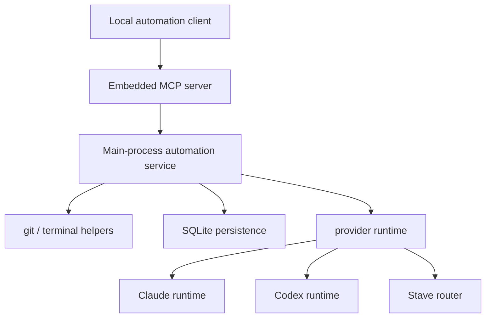

# Embedded Local MCP Plan

This document captures the production-side plan for exposing Stave as a same-machine MCP server from the packaged Electron app.

## Goal

- Let local automation clients talk to a running Stave desktop app over MCP.
- Support packaged desktop installs, not only `bun run dev` flows.
- Reuse Stave's existing provider runtimes, worktree model, SQLite persistence, and task snapshots instead of building a parallel automation stack.

## Why This Shape

- `server/dev-server.ts` is browser-dev-only and Bun-specific, so it is not the right production surface.
- Electron main already owns the stable runtime boundaries:
  - provider execution
  - terminal / git automation
  - SQLite persistence
- Same-machine bot orchestration benefits from a local-only transport and a shared durable task database.

## Target State

The packaged Electron app starts a local-only MCP endpoint in the main process.

Clients can:

- register or refresh a project
- create a git-worktree workspace
- create and run a task in that workspace
- inspect task / turn state
- respond to approval and user-input requests

Stave persists the resulting workspace/task/messages/turns into the same SQLite-backed model used by the renderer.

## Constraints

- Scope is local-machine only for this phase.
- No remote exposure, public port opening, or internet-facing auth in this phase.
- The MCP surface should not depend on the renderer being open or focused.
- The implementation should keep using the existing provider runtime contracts.
- Dedicated automation workspaces are preferred over mutating a manually active workspace.

## Scope Analysis

### Moves

These responsibilities move into a reusable main-process automation service:

| Path | Role |
|---|---|
| `src/store/app.store.ts` | workspace creation flow currently tied to renderer state |
| `src/store/app.store.ts` | task creation + prompt send flow currently tied to renderer state |

### Stays

These remain source-of-truth layers:

| Path | Role |
|---|---|
| `electron/providers/*` | Claude, Codex, Stave routing and streaming |
| `electron/persistence/*` | SQLite storage |
| `electron/main/utils/command.ts` | shell/git execution |
| `src/store/workspace-turn-replay.ts` | provider-event replay reducer |
| `src/store/chat-state-helpers.ts` | task/message seeding helpers |

### Breaks

These cross-cutting concerns need explicit handling:

| Concern | Current state | Plan |
|---|---|---|
| External control surface | none in production desktop runtime | add a main-process MCP server |
| Discovery for local bots | none | write a local manifest with URL/token |
| Snapshot updates during external turns | renderer store currently owns it | replay provider events in main and persist snapshots there |
| Approval / user-input loop | renderer UI currently drives it | expose explicit MCP tools for responses |
| Live renderer sync | no reverse bridge from external automation | keep snapshot durable first; live renderer refresh can follow |

## Architecture

## API Shape

Initial tool set:

- `stave_register_project`
- `stave_create_workspace`
- `stave_run_task`
- `stave_get_task`
- `stave_respond_approval`
- `stave_respond_user_input`

Non-goals for the first pass:

- remote auth
- multi-user tenancy
- general-purpose resource browsing
- live push into already-open renderer state

## Migration Phases

### Phase 1

- add an embedded local MCP server in Electron main
- add a local manifest/token discovery file for same-user clients
- expose health and MCP endpoints

### Phase 2

- add a reusable automation service in main
- move project/workspace/task orchestration into shared helpers
- replay provider events into durable workspace snapshots

### Phase 3

- expose approval/user-input continuation tools
- persist approval and completion notifications for externally started turns

### Phase 4

- add renderer refresh hooks for externally mutated active workspaces
- tighten observability and failure reporting

## Risks

| Risk | Impact | Mitigation |
|---|---|---|
| External automation and UI both mutate the same workspace | High | recommend dedicated automation workspaces; keep cache per workspace and reload from persisted snapshots |
| Local endpoint becomes a security footgun | High | bind to `127.0.0.1`, require token, do not expose remote listeners |
| Provider turn state diverges from workspace snapshot | High | use the shared replay reducer already used by the renderer |
| Packaged app discovery is awkward | Medium | write a stable same-user manifest outside the app bundle |
| Renderer does not live-refresh | Medium | accept for first pass, document it, add follow-up event bridge |

## Verification

- packaged desktop runtime starts and writes a valid connection manifest
- MCP tools can create a project default workspace and a new branch workspace
- a task run produces persisted turns and persisted chat snapshot updates
- approval/user-input responses continue the same turn
- `bun run typecheck` passes after the new main-process surface is wired
