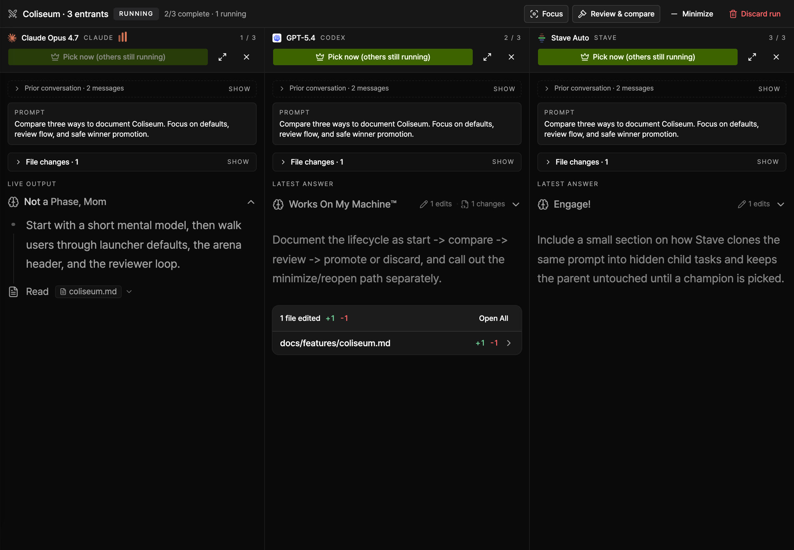
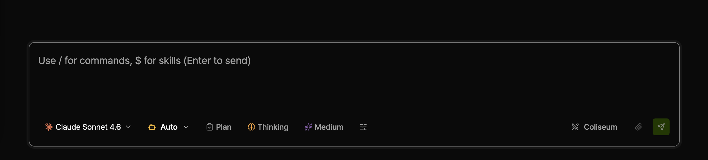
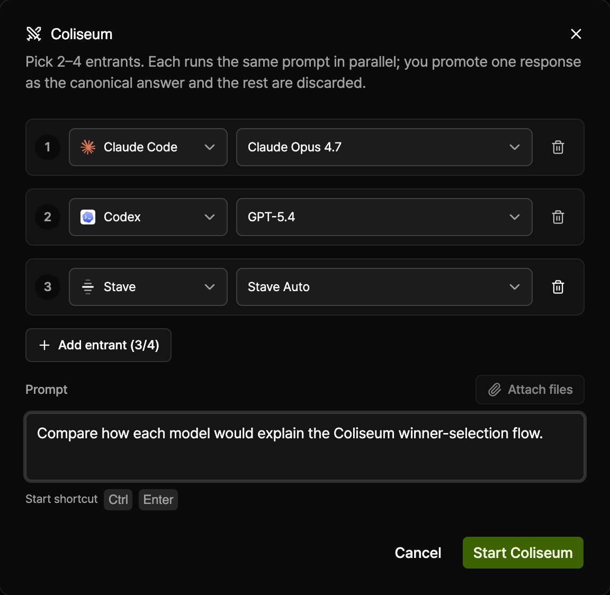
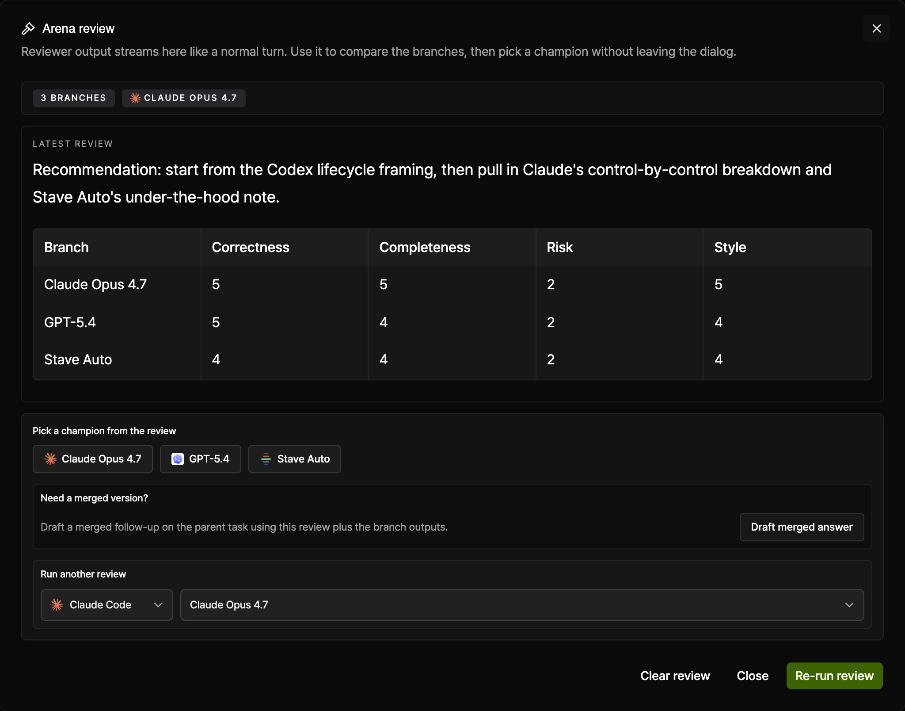

# Coliseum

_One prompt fans out across multiple entrants, while the parent task stays untouched until you pick a winner._

Run the same prompt across 2-4 entrants in parallel, compare the results side by side, and promote one answer back into the parent task when you are ready.

## Summary

- Coliseum is Stave's side-by-side model comparison flow.
- You choose a lineup of `(provider, model)` entrants, send one shared prompt, and watch each branch stream independently inside the arena.
- Nothing is written into the parent task until you explicitly pick a champion.
- After a winner is picked, you can still review, re-pick, merge ideas from other branches, or finish the arena.

## When To Use It

Use Coliseum when:

- You want to compare how different models solve the same request before committing anything to the main task.
- You are testing whether Claude, Codex, or `stave-auto` produces the clearest result for a prompt.
- You want a reviewer model to compare multiple drafts and recommend a winner.
- You need a strong final answer assembled from several branches rather than trusting one model run.

Skip Coliseum when:

- You already know which model you want and a normal single-model turn is enough.
- The parent task is still streaming, waiting on approval, or otherwise busy.
- The task is externally managed and Stave cannot take over the turn lifecycle.
- You want a multi-turn branch conversation. Coliseum is a single fan-out round, not a long-lived branch workspace.

## Before You Start

- Coliseum supports **2 to 4 entrants**.
- Every entrant is a real provider turn, so total cost and token usage scale with the number of branches you run.
- The parent task must be idle before you can launch the arena.
- Shared prompt text, attached files, and attached images are copied into every branch's first user message.
- When Claude is selected inside Coliseum, new Claude rows default to **Opus 4.7**.

## Quick Start

1. Open a task and look above the composer for the **Coliseum** button.

   

   _The launcher lives in the composer control strip and is only available when the parent task is idle._

2. Click **Coliseum** to open the launcher dialog.

   

   _A new run starts with two entrants by default. You can add a third or fourth row before starting._

3. Pick the entrants you want to compare. Each row has a provider picker and a model picker.
4. Type the one prompt every entrant should run. Optionally attach files.
5. Click **Start Coliseum**.
6. Compare the live columns in the arena, optionally open **Review & compare**, then either:
   - pick a winner and **Finish arena**
   - or **Discard run** to throw everything away

## Interface Walkthrough

### Entry Point

- The **Coliseum** button appears above the composer for the active task.
- If the task is streaming, the button stays disabled until the current turn finishes or you stop it.
- If a run is minimized, the same spot changes into **Reopen arena** so you can jump back into the comparison.

### Launcher Dialog

- **Entrant rows**: each row is one `(provider, model)` pair.
- **Provider picker**: switching providers resets the row to that provider's Coliseum default model.
- **Model picker**: choose the exact model variant for that row.
- **Add entrant**: expands the lineup up to four branches.
- **Remove entrant**: drops a row, but never below two entrants.
- **Prompt**: the shared request every branch receives.
- **Attach files**: sends the same file context to every entrant.
- **Start shortcut**: `Cmd/Ctrl + Enter`.
- **Validation**: the start button stays disabled until every row is valid, every provider is available, and the prompt is non-empty.

### Arena Header

- **Status badge**: shows whether the run is still `Running`, fully `Ready`, or already `Promoted`.
- **Focus / Grid**: switches between all-columns view and single-branch focus mode.
- **Review & compare**: launches or reopens the reviewer flow once at least one branch has finished.
- **Minimize**: hides the arena and returns you to the normal task view without ending the run.
- **Discard run**: aborts every branch and removes the arena if you have not promoted a winner.
- **Finish arena**: appears after a champion is picked and closes the arena while keeping the promoted answer on the parent task.
- **Unpick**: appears after promotion and rolls the parent task back to its pre-fan-out state so you can choose a different branch.
- **Use ideas from**: appears after promotion and stages a follow-up draft that pulls ideas from non-winning branches into the parent task.

### Branch Columns

- **Column header**: shows the branch's provider, exact model, live activity state, and column index.
- **Pick champion**: promotes that branch immediately. If other branches are still running, they stay alive so you can keep comparing.
- **Focus this branch**: expands one branch and collapses the others into a rail.
- **Close this branch**: drops just that branch. If only one branch would remain, the whole Coliseum is discarded.
- **Prior conversation**: when the parent already had messages before fan-out, each branch can show the copied pre-fan-out context in a collapsible section.
- **Prompt card**: shows the shared fan-out request at the top of the column.
- **File changes**: lists touched files when the branch produced edit or diff output.
- **Latest answer**: renders the branch's most recent assistant output with the same trace UI used in normal task chat.

### Reviewer Dialog

_The reviewer compares branch outputs, recommends a winner, and can queue a merged follow-up draft on the parent task._

- **Available after first completion**: the review button stays disabled until at least one branch has produced an answer.
- **Reviewer provider + model**: choose which model should compare the branches. When the reviewer is Claude, Coliseum defaults it to **Opus 4.7**.
- **Live verdict stream**: reviewer output streams into the dialog like a normal turn.
- **Re-run review**: runs a fresh comparison against the current branch outputs.
- **Clear review**: removes the current verdict without affecting the branches.
- **Draft merged answer**: creates a parent-task draft that uses the reviewer verdict plus branch outputs to synthesize one stronger final answer.

## Common Workflows

### Compare Models Before Choosing One

1. Start a Coliseum with 2-4 entrants.
2. Watch the branches stream in parallel.
3. Open focus mode if one branch deserves closer inspection.
4. Compare the prompt card, file changes, and final answer in each column.

### Promote, Re-Pick, And Finish

1. Click **Pick champion** on the branch you want to keep.
2. Stave grafts that branch's post-fan-out messages into the parent task.
3. If you change your mind, click **Unpick** and select a different branch.
4. When you are satisfied, click **Finish arena** to leave comparison mode.

### Review Branches And Draft A Merged Answer

1. Wait until at least one branch finishes.
2. Click **Review & compare**.
3. Let the reviewer recommend the best branch and call out trade-offs.
4. Use **Draft merged answer** if you want the parent task to synthesize one final response from several branches instead of promoting a single winner unchanged.

### Pause The Arena Without Losing It

1. Click **Minimize**.
2. Continue browsing the parent task normally while branches keep running.
3. Click **Reopen arena** above the composer to restore the comparison view.

### Throw The Run Away

1. Click **Discard run** before finishing.
2. Stave aborts every remaining branch and removes the arena.
3. The parent task returns to the exact state it had before Coliseum started.

## How It Works

- Stave creates one hidden child task per entrant.
- Each child task receives the same prompt payload, attachments, and inherited runtime mode settings from the parent.
- Branch tasks stay hidden from the task list, sidebar previews, and task tabs. You interact with them only through the arena.
- The parent task remains unchanged while the run is active.
- When you promote a winner, Stave appends only that branch's post-fan-out tail back into the parent task.
- If you discard the run, close branches, or reload a workspace with stale branch records, Stave reaps the ephemeral tasks automatically.

## Limitations And Advanced Options

- Coliseum is a one-round comparison. You cannot chat back and forth inside individual branches.
- The layout is capped at four entrants to keep the arena readable.
- Shared attachments are copied once at launch. Branches do not re-read files automatically after the run has started.
- Nested Coliseums are blocked.
- Managed tasks cannot launch Coliseum until Stave owns the task again.
- Running large or expensive models in every branch can multiply cost quickly. Use smaller models or `stave-auto` when you want a cheaper exploratory pass.

## Troubleshooting

### The Coliseum button is missing

- Symptom: the control strip above the composer does not show **Coliseum**.
- Cause: no active task is selected, or the task view is still hydrating.
- Fix: select a task and wait for the task view to finish loading.

### The Coliseum button is disabled

- Symptom: hovering the button says you must wait for the current turn to finish.
- Cause: the parent task still has a running turn.
- Fix: wait for the turn to end or stop it, then reopen the launcher.

### Start Coliseum stays disabled

- Symptom: the dialog never enables **Start Coliseum**.
- Cause: one row is incomplete, the prompt is empty, or a selected provider is unavailable.
- Fix: verify every row has a valid provider and model, enter a prompt, and confirm provider availability in the task controls.

### Review & compare is disabled

- Symptom: the arena header shows **Review & compare**, but it cannot be clicked yet.
- Cause: no branch has finished producing an answer.
- Fix: wait for the first completed branch, then open the reviewer.

### One branch looks stuck

- Symptom: one column keeps showing a live state without useful output.
- Cause: that provider or model may have failed, stalled, or been rate-limited.
- Fix: close just that branch and continue with the remaining entrants, or rerun the whole Coliseum with a different lineup.

### A branch task shows up after reload

- Symptom: you briefly see a duplicated task title or a stale hidden branch.
- Cause: a stale runtime branch survived until workspace bootstrap.
- Fix: reload the workspace. Stave reaps orphan Coliseum tasks on load.

## Related Docs

- [Provider Sandbox and Approval](provider-sandbox-and-approval.md)
- [Stave Model Router](stave-model-router.md)
- [Attachments](attachments.md)
