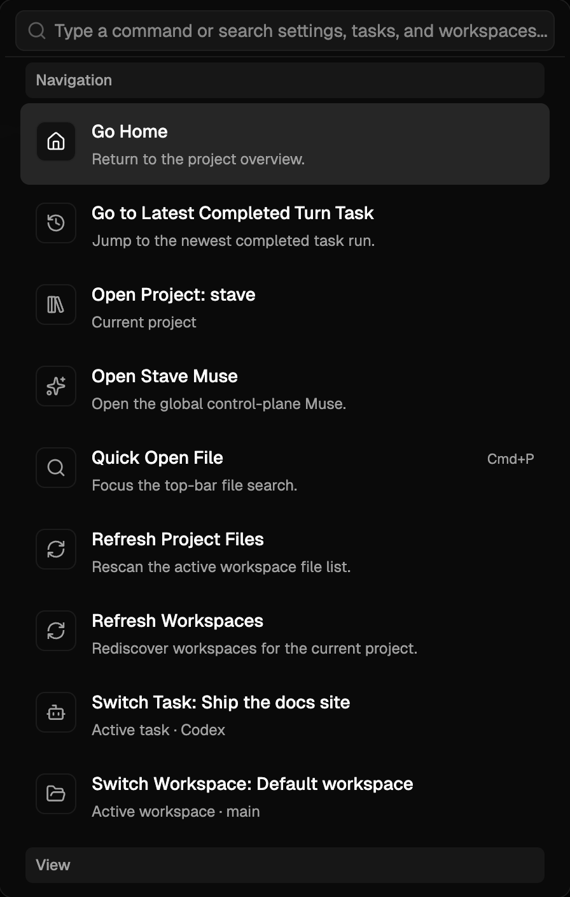

# Command Palette

Use the Command Palette when you know what you want to do in Stave but do not want to hunt through the UI first.

This example shows the global palette listing navigation, task, settings, and workspace actions in one searchable view.

## What It Is For

- Jump to app actions from anywhere in Stave.
- Open settings, switch views, create tasks, and move around the workspace without relying on the mouse.
- Reach the same action quickly even when you do not remember where the visible button lives.

## Open The Palette

- Press `Cmd/Ctrl+Shift+P`
- Or open it from the app chrome when a command-palette entry point is visible

The palette is global. You do not need to focus the chat composer first.

## Typical Commands

### Navigation

- quick open a file
- go home
- switch task, workspace, or project
- refresh project files or workspaces

### View

- toggle the workspace sidebar
- show or hide Explorer, Information, editor, or terminal surfaces
- enter or exit Zen Mode

### Task

- create a new task
- stop the active turn
- continue work in a new workspace
- open create-PR flow

### Provider And Settings

- switch between Claude, Codex, and Stave Auto
- open Settings
- jump directly to a specific settings section
- open keyboard shortcuts

### External Workspace Actions

- reveal the active workspace
- open the active workspace in VS Code
- open the active workspace in Terminal

## Quick Start

1. Press `Cmd/Ctrl+Shift+P`.
2. Type a few words that describe the action you want, such as `terminal`, `settings`, `task`, or `workspace`.
3. Use the arrow keys to move through the results.
4. Press `Enter` to run the selected action.

## How To Use It Well

### Jump To An Action You Use Often

1. Open the palette.
2. Type a short keyword such as `explorer`, `zen`, or `new task`.
3. Run the command directly from the result list.

This is the fastest way to learn Stave's navigation model without memorizing every button location first.

### Open A Settings Section Directly

1. Open the palette.
2. Search for a settings area such as `providers`, `design`, or `shortcuts`.
3. Run the matching settings command.

This is usually faster than opening Settings and browsing manually.

### Work Mostly From The Keyboard

- Keep the palette for app-level actions.
- Keep slash commands in the prompt composer for provider-specific prompt behavior.

That separation matters: the Command Palette controls Stave itself, while slash commands affect what the model does inside a task.

## Related Shortcuts

- `Cmd/Ctrl+P` focuses file quick open in the top bar.
- `Cmd/Ctrl+,` opens the main Settings dialog.
- `Cmd/Ctrl+B` toggles the left workspace sidebar.
- `Cmd/Ctrl+Shift+B` toggles the changes panel.
- `Cmd/Ctrl+E` opens Explorer.
- `Cmd/Ctrl+I` toggles the Information panel.
- `Cmd/Ctrl+K`, then `Z` toggles Zen Mode.
- `Alt+P` opens the prompt model selector.

## Troubleshooting

### I expected a slash command result

- Symptom: you search for a provider slash command in the Command Palette and do not see the result you want.
- Cause: slash commands belong to the prompt composer, not the global palette.
- Fix: place the cursor in the prompt composer and use the provider's slash-command flow there.

### I cannot remember the exact command name

- Symptom: the result list does not show what you expected.
- Cause: you searched too narrowly.
- Fix: try broader words such as `terminal`, `workspace`, `provider`, or `settings` instead of the full label.

## Related Docs

- [Integrated Terminal](integrated-terminal.md)
- [Zen Mode](zen-mode.md)
- [Runtime Safety Controls](provider-sandbox-and-approval.md)
