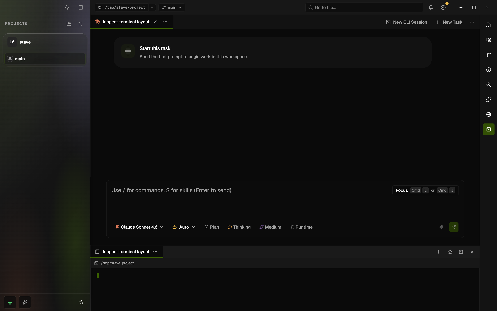

# Integrated Terminal

## Summary

- Stave includes two terminal surfaces:
  - a docked workspace terminal for general shell work
  - full-panel CLI sessions for running Claude or Codex directly inside the main workspace area
- You can open a terminal for the workspace root or for a specific Explorer path without leaving Stave.
- Live PTY sessions now run in an isolated host-service child process instead of sharing the Electron main-process event loop.

This rendered example shows the docked terminal inside the main Stave workspace shell. Docked terminals stay below the main content area, while CLI sessions take over the center panel.

## When To Use It

- Use the docked terminal when you need a quick shell in the current workspace while keeping chat, editor, and Explorer visible.
- Use a CLI session when you want the main center panel to become a dedicated Claude or Codex terminal surface.
- Use it when you want a terminal tab tied to the current workspace instead of opening a separate system terminal window.
- Use the system terminal entry point when you explicitly want an external shell window managed by your OS.

## Before You Start

- Open a project or workspace in Stave first.
- The integrated terminal uses the workspace path as its shell root.
- Claude CLI sessions always start in Claude auto mode. Claude Code `2.1.71+` supports this natively; older CLI builds fall back to `default` permission mode because they reject `--enable-auto-mode` and `--permission-mode auto`.

## Quick Start

1. Click the `Terminal` button to show the docked terminal.
2. If no terminal tab exists yet, Stave creates one for the active workspace.
3. Use the dock header tab strip to switch, create, rename, or close docked terminal tabs.
4. Use `New CLI Session` in the top strip, or from the no-task empty state, when you want to launch `Claude` or `Codex` in the center panel.

## Interface Walkthrough

### Entry Points

- `Terminal` button in the main workspace chrome toggles the dock visibility.
- `Open in Stave Terminal` in the top bar workspace path menu opens a terminal tab for the current workspace path.
- `Open in Stave Terminal` in the Explorer context menu opens a terminal tab rooted at the selected folder or file parent directory.
- `New CLI Session` in the no-task empty state opens a workspace-scoped `Claude` or `Codex` session before you create the first task.
- `New CLI Session` in the top strip opens one of four direct launch combinations:
  - `Claude · Workspace`
  - `Claude · Active Task`
  - `Codex · Workspace`
  - `Codex · Active Task`

### Key Controls

- The top strip shows task tabs and CLI session tabs.
- Docked terminal tabs are fully managed inside the dock header and no longer appear in the top strip.
- Selecting a task tab changes the chat context.
- Selecting a CLI session tab replaces the main chat panel with that live CLI surface without changing the stored active task.
- The dock header manages docked terminal tabs, clear, hide, and close actions.
- Middle-click closes docked terminal tabs and CLI session tabs using the same close flow as the explicit close actions.
- The CLI session header exposes provider/context metadata plus `Copy Handoff`, `Paste Handoff`, `Restart Session`, and `Close Session`.

## Common Workflows

### Create Or Configure Something

1. Click the dock `Terminal` toggle to create or reveal a docked terminal tab.
2. Stave uses the active task title when a task is linked, or the current path name when the tab is path-based.
3. Rename a terminal tab from the dock tab menu when you want a custom label.

### Run Or Verify Something

1. Select the docked terminal tab you want from the dock header.
2. Run commands in the docked shell.
3. Success looks like streamed shell output in the dock while the rest of the workspace stays interactive.

### Run Claude Or Codex In-Panel

1. Click `New CLI Session` in the top strip.
2. Pick the provider and context combination you want.
3. Stave opens a new center-panel CLI session tab and starts the provider CLI directly.
4. If the session is task-linked, use `Paste Handoff` to inject the stored task summary into the live terminal.

### Start A CLI Session Before Creating A Task

1. Open a workspace that does not have any active tasks yet.
2. In the empty-state card, click `New CLI Session`.
3. Pick `Claude · Workspace` or `Codex · Workspace`.
4. Stave opens the CLI session in the center panel without forcing you to create a task first.

## Files And Data

- Docked terminal tabs and CLI session tabs are both stored as part of the workspace shell state.
- The dock keeps a best-effort local transcript cache for fast restore.
- CLI sessions restore from the host-side PTY snapshot and bounded backlog instead of a hidden renderer cache.
- Live shell and provider CLI processes can survive a workspace switch and reattach when you return.
- Renderer ownership is surface-specific even though PTY execution is isolated in the desktop backend child process.

## Limitations And Advanced Options

- The dock shows one active terminal viewport at a time even when multiple docked terminal tabs exist.
- CLI sessions rebuild their renderer when you reactivate them, so local selection and viewport position are not preserved even when the live process is.
- `Open in Terminal` still opens the external system terminal. It is separate from `Open in Stave Terminal`.

## Troubleshooting

### Terminal Tab Opens But No Output Appears

- Symptom: the dock opens but the terminal stays blank.
- Cause: the terminal bridge failed to create or connect a session.
- Fix: reopen the terminal tab or restart the desktop app with `bun run dev:desktop` if you are in local development.

### External Terminal Opens Instead Of The Integrated One

- Symptom: a system terminal window opens outside Stave.
- Cause: you used `Open in Terminal`, which keeps the external-terminal behavior.
- Fix: use `Open in Stave Terminal` from the same menu.

### CLI Session Fails To Start

- Symptom: the center panel switches to a CLI session tab but shows an error banner.
- Cause: the provider CLI executable is unavailable in the current runtime or the bridge could not launch it.
- Fix: check Claude/Codex CLI installation, verify the Codex binary path setting if applicable, or run the desktop shell with `bun run dev:desktop` during local development.

## Related Docs

- [Command Palette](command-palette.md)
- [Zen Mode](zen-mode.md)
- [Terminal regression prevention](../developer/terminal-regression-prevention.md)
- [Project / workspace / task shell redesign](../ui/project-workspace-task-shell.md)
