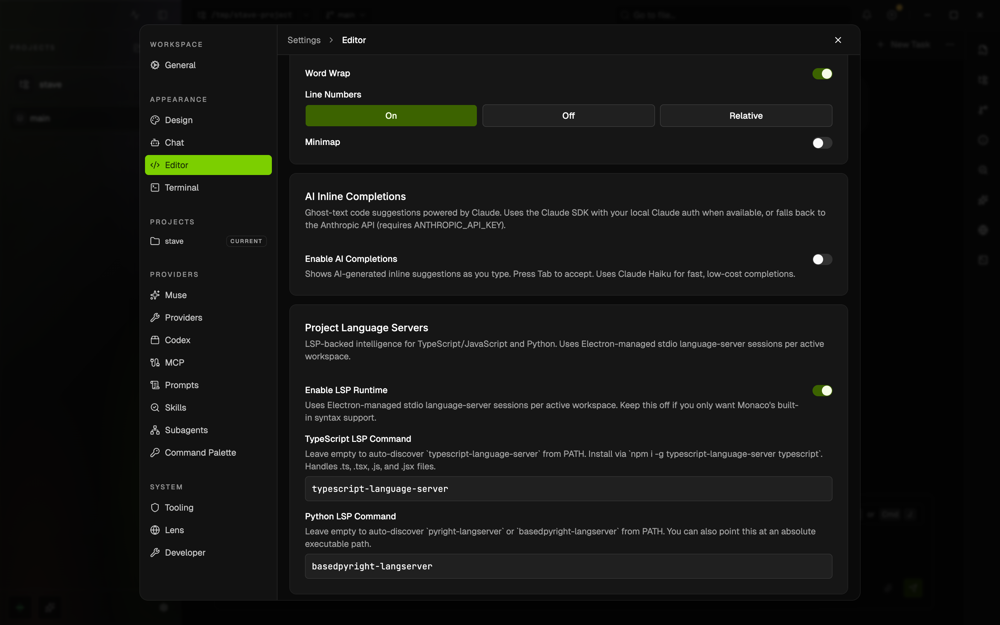

# Language Intelligence

Stave supports two editor intelligence paths today.



This rendered example shows the `Settings → Editor` section with the `Project Language Servers` card and command overrides for TypeScript and Python LSP runtimes.

## Built-in Monaco support

TypeScript and JavaScript use Monaco's built-in TypeScript worker plus workspace-loaded `tsconfig.json`, source files, and type libraries.

That path powers:

- module resolution
- diagnostics
- hover
- completion
- go to definition

## Project language servers

Stave also has an Electron-managed Language Server Protocol runtime for project-level intelligence that should follow the active workspace root.

Current support:

- TypeScript and JavaScript via `typescript-language-server`
- Python via `pyright-langserver` or `basedpyright-langserver`

The editor settings expose:

- a toggle to enable the LSP runtime
- a TypeScript LSP command override
- a Python LSP command override

When enabled, Stave starts one stdio-backed language-server session per active workspace root and language, then forwards Monaco document sync, hover, completion, definition, and diagnostics through Electron IPC.

Notes:

- TypeScript and JavaScript still keep Monaco's built-in worker-based support. The LSP runtime is the optional project-level layer on top.
- The TypeScript server handles `.ts`, `.tsx`, `.js`, and `.jsx` files through the same workspace session.

## macOS file-system permissions

When a file is opened in the editor, Stave reads workspace source files and TypeScript type definitions from `node_modules` to power IntelliSense. If the project lives inside a macOS-protected folder (`~/Desktop`, `~/Documents`, `~/Downloads`, or iCloud Drive), the OS shows a consent dialog the first time access is attempted.

**Production builds** — the dialog appears once and the grant is stored permanently in the macOS TCC database. No action needed after that first approval.

**Development builds** — the Electron binary is replaced on every rebuild, which invalidates the previous TCC grant and causes the dialog to reappear each session. To suppress it during development, grant permanent access manually:

```
System Settings → Privacy & Security → Files and Folders
→ find Stave (or Electron) and toggle on each folder you work in
```

Alternatively, keep your development workspace outside a protected folder (e.g. directly under `~`) to avoid the TCC check entirely.

## Current limits

- TypeScript/JavaScript LSP support depends on an installed external language server
- Python support depends on an installed external language server
- the active workspace root is the session boundary
- nested per-package config discovery is not implemented yet
- rename, references, and code actions are not implemented yet
