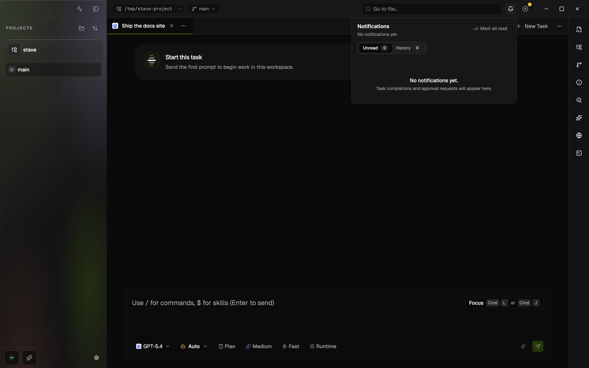

# Notifications

Stave has an in-app notification center that tracks task activity across every project and workspace you have open, so you can step away from a task and still know when it needs you again.

The notification center lives in the top bar behind the bell icon.

## What Notifications Tell You

- A task turn finished.
- A task is waiting for your approval.
- A task needs extra input before it can continue.

Notifications stay in the app even if you close and reopen Stave, and even if the originating task has been archived.

## Open The Center

- Click the bell icon in the top bar.
- A badge shows how many unread items you have.
- Unread items sit in the main inbox.
- Items you read move into a history view but stay available.

## Respond To Approvals

You do not have to scroll back through the task chat to approve or deny a tool call.

- Open the bell and find the approval entry.
- Approve or deny it directly from the notification.
- The change is reflected back in the task immediately.

If you prefer, the task itself also shows a pending-approval card above the composer.

## Jump Back To A Task

- Click a notification.
- Stave switches to the right project, workspace, and task.
- If the task was archived, Stave asks you to restore it before reopening.

## Success Sound

You can play a short sound when a task turn finishes. This is useful when you have a long-running task in the background and want a quick audio cue.

1. Open `Settings > General`.
2. Find `Task Completion Sound`.
3. Enable it, choose a preset, and set the volume.
4. Click `Preview` to hear it.

## Tips

- Use the notification center instead of keeping every task view open side by side.
- Mark approvals `Deny` from the center if you want to stop a long agent without losing the current task.
- If you switch devices or restart Stave, notification history comes back with you.

## Troubleshooting

### I Never See New Notifications

- Symptom: the bell stays at zero even though a task just finished.
- Cause: the turn never fully completed, so the workspace is still responding.
- Fix: look at the task; if the indicator is still animating, the turn is not yet considered finished.

### Clicking A Notification Does Nothing

- Symptom: selecting an entry does not navigate anywhere.
- Cause: the task was archived.
- Fix: Stave asks you to restore the task before reopening it. Accept the restore prompt.

### The Sound Does Not Play

- Symptom: turns finish but no sound plays.
- Cause: the sound is disabled or the volume is set to zero.
- Fix: open `Settings > General > Task Completion Sound`, enable it, raise the volume, and click `Preview`.

## Related Docs

- [Runtime Safety Controls](provider-sandbox-and-approval.md)
- [Latest Turn Summary](workspace-latest-turn-summary.md)
- [Command Palette](command-palette.md)
