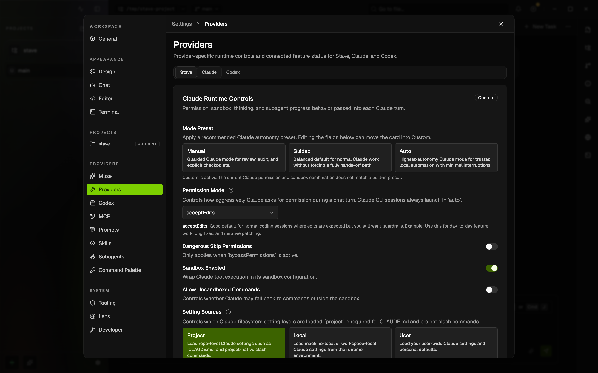
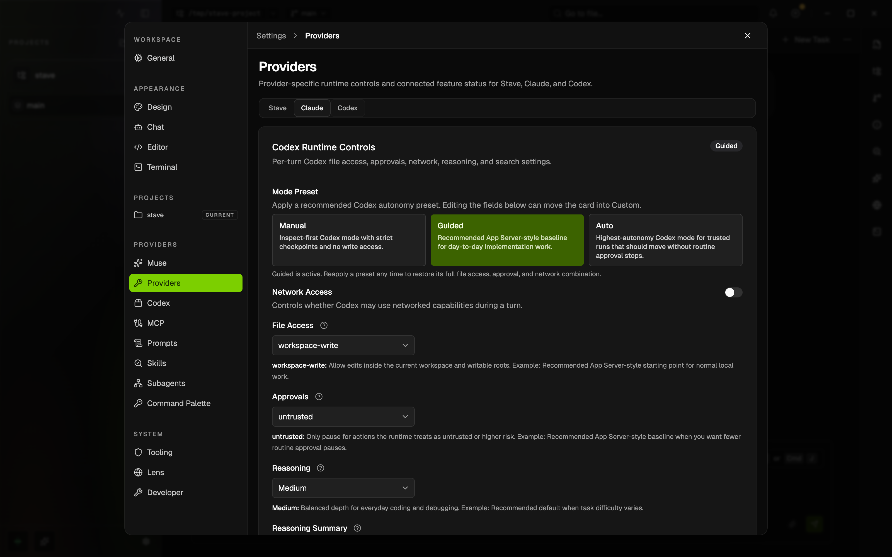

# Provider Sandbox And Approval Guide

Stave lets you choose how much freedom Claude or Codex gets before a turn starts.

This example shows the Claude runtime controls inside Settings.

This example shows the Codex runtime controls for file access, approvals, and network behavior.

## What This Guide Helps You Decide

- whether the provider can edit files
- whether it should stop for approval
- whether network access should stay off
- whether the next turn should stay in planning mode

These controls are product-facing workflow settings. They are the fastest way to move between review-only work, normal edits, and more autonomous local automation.

## Where To Find The Controls

1. Open `Settings`.
2. Go to `Providers`.
3. Choose the `Claude` or `Codex` tab.
4. Review the preset and the individual runtime controls before sending the next turn.

You can also confirm the effective state from the runtime chips near the composer.

## Recommended Starting Points

### Review Or Planning Work

- prefer a guarded preset
- keep network off unless the task explicitly needs it
- use Codex `read-only` when you need strict no-write behavior

### Normal Day-To-Day Edits

- use the default guided or workspace-write style setup
- allow edits in the current repository
- keep approvals on if you still want a checkpoint before higher-risk actions

### Trusted Local Automation

- only use the most permissive preset when you trust both the task and the working directory
- verify the runtime chips before sending

## Provider Differences

### Claude

Claude focuses its safety model around permission mode and sandbox behavior.

Use Claude controls when you want to decide:

- how often Claude should ask for permission
- whether sandboxing should stay on
- whether sandbox escape should be allowed

### Codex

Codex exposes file access and approvals as separate controls.

Use Codex controls when you want to decide:

- `read-only` versus `workspace-write`
- whether approvals should stay on
- whether network access should remain off
- whether the turn should stay in planning mode

## Quick Start

1. Open `Settings → Providers`.
2. Pick the provider you are about to use.
3. Start from a preset instead of changing every field individually.
4. Confirm the effective runtime chips near the composer.
5. Send a small, harmless turn first if you are testing a new configuration.

## Common Workflows

### I only want inspection

1. Choose Codex.
2. Set file access to `read-only`.
3. Keep approvals on if you want explicit checkpoints.
4. Send the turn.

### I want normal repo edits

1. Choose the provider you prefer.
2. Start from the normal guided preset.
3. Make sure the next turn is allowed to work in the repository, but not beyond it.
4. Confirm the runtime chips before sending.

### I want planning without edits

1. Turn on plan mode for the draft turn.
2. Check that the runtime display now reflects a planning-only path.
3. Send the turn.

### I need more autonomy for a trusted local task

1. Move to the more permissive preset.
2. Recheck approvals, file access, and network settings.
3. Only then send the turn.

## Troubleshooting

### The provider is still read-only

- Symptom: you expect edits, but the runtime display still shows read-only behavior.
- Cause: the draft turn is still in planning mode, or the provider is using a guarded preset.
- Fix: turn planning off and confirm the effective runtime chips again.

### Claude refuses a command I expected it to run

- Symptom: Claude stops or asks for permission earlier than expected.
- Cause: the current permission or sandbox settings are more restrictive than the task needs.
- Fix: loosen the runtime settings only if you trust the task and the working directory.

### I am not sure what will happen before I send

- Symptom: you changed settings but are unsure which ones actually apply.
- Cause: multiple controls are active at once.
- Fix: rely on the composer-side runtime chips and send a low-risk prompt first.

## Related Docs

- [Project Instructions](project-instructions.md)
- [Local MCP](local-mcp-user-guide.md)
- [Install Guide](../install-guide.md)
