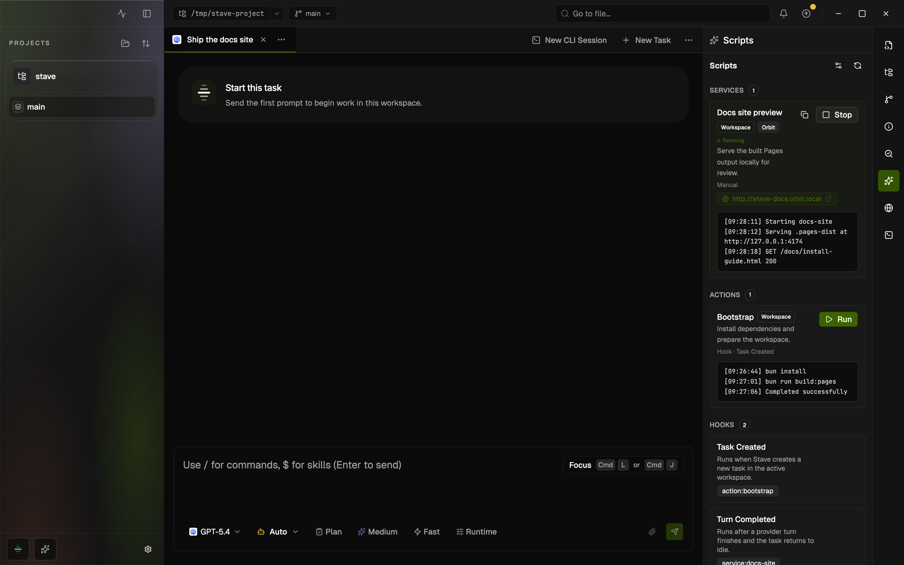

# Workspace Scripts

## Summary

- Workspace Scripts let Stave run workspace actions, long-running services, and lifecycle hooks from the right rail.
- The Scripts Manager now lives under `Settings > Projects`, where it provides a lightweight GUI for editing shared `actions`, `services`, and `hooks` in `.stave/scripts.json` without exposing a raw JSON editor.
- Script execution now runs through the isolated desktop host-service child process, which keeps long-lived output and hook churn off the Electron main-process event loop.



This rendered example shows the right-rail Scripts runtime with a running local docs preview service, a completed bootstrap action, and hook wiring for the current workspace.

## When To Use It

- Use this when a workspace needs repeatable setup commands, dev services, or task/turn/PR lifecycle scripts.
- Use it when you want teammates to share the same script entry points through the Stave UI.
- Use manual JSON editing instead when you need custom `targets` or advanced `.stave/scripts.local.json` overrides.

## Before You Start

- Open a project in Stave and select a workspace.
- Make sure the workspace has write access to its `.stave/` folder.
- If you need project-wide scripts, decide whether the config should live in the repository root or in the active workspace.
- Workspace-level shared config is editable when that project is the current project in Stave.

## Quick Start

1. Open `Settings > Projects`.
2. Select the project, then use `Scripts Manager`.
3. Choose `Project Config` or `Workspace Config`.
4. Add an `Action` or `Service`, fill in the id, target, and commands, then save.
5. Add hook links if the script should run from `task.created`, `task.archiving`, `turn.started`, `turn.completed`, `pr.beforeOpen`, or `pr.afterOpen`.
6. Open the right rail `Scripts` tab to run the entry and verify the merged runtime for the current workspace.

## Interface Walkthrough

### Entry Points

- Open `Settings > Projects`, select a project, and edit shared scripts config in `Scripts Manager`.
- Open the right rail and select the `Scripts` tab to inspect the merged runtime for the active workspace.
- The runtime panel shows the resolved actions, services, hooks, config paths, and quick access back to project settings.

### Key Controls

- `Config Scope`: chooses which shared `.stave/scripts.json` file the manager edits.
- `Add Action`: creates a short-lived runnable command sequence.
- `Add Service`: creates a long-running process that can be started and stopped from the panel.
- `Hooks`: links actions or services to lifecycle triggers.
- `Save`: writes the selected shared config file.
- `Reload`: re-reads the selected config file from disk.
- `Discard`: throws away unsaved GUI changes and reloads the file.
- `Edit Config`: opens `Settings > Projects` from the right-rail runtime panel.
- `Refresh`: reloads the effective runtime for the active workspace.

## Common Workflows

### Create An Action

1. Open `Settings > Projects` and click `Add Action`.
2. Set a stable `ID` such as `bootstrap` or `test-ci`.
3. Add a label and description if the default generated name is not enough.
4. Choose a `Target`:
   - `Workspace` runs inside the active workspace path.
   - `Project` runs in the repository root.
5. Enter one shell command per line in `Commands`.
6. Save, then run the action from the right-rail `Scripts Runtime`.

### Create A Service

1. Open `Settings > Projects` and click `Add Service`.
2. Enter the service id and one or more commands.
3. Set `Restart on run` if Stave should replace an existing running process when you run it again.
4. Enable `Use Orbit` when the service should run through `portless` and expose an Orbit URL.
5. Optionally set `Orbit Name`, `Orbit Proxy Port`, or `Plain HTTP` for local routing preferences.
6. Save, then use `Run` / `Stop` from the right-rail `Scripts Runtime` to manage the service.

Orbit works best when the service command is a direct dev-server command such as `yarn start`, `pnpm dev`, or `bun run dev`.
For those commands, Stave passes the argv directly to `portless run`, which lets Portless assign an ephemeral app port and inject `--port` / `--host` flags for supported frameworks.
If the command relies on shell-only syntax such as `&&`, pipes, redirects, command substitution, or inline env assignments, Stave falls back to a shell wrapper and the underlying app must still honor `PORT` / `HOST` on its own.

### Wire A Hook

1. Open `Settings > Projects` and scroll to `Hooks`.
2. Find the trigger you need.
3. Toggle `Enabled` on the action or service you want linked.
4. Leave `Blocking` on when failures should stop the parent workflow, or turn it off for best-effort execution.
5. Save, then test the hook from the `Hooks` section in the right-rail runtime panel.

### Verify The Runtime

1. Save the manager changes in `Settings > Projects`.
2. Open the right rail `Scripts` tab and use `Refresh`.
3. Run the target action, service, or hook.
4. Inspect the live status badge, error message, and log output in the panel.

## Files And Data

- Shared project config: `<project>/.stave/scripts.json`
- Shared workspace config: `<workspace>/.stave/scripts.json`
- Optional advanced local override: `<project-or-workspace>/.stave/scripts.local.json`

Minimal shared config example:

```json
{
  "version": 2,
  "actions": {
    "bootstrap": {
      "label": "Bootstrap",
      "description": "Install dependencies and prepare the workspace.",
      "commands": [
        "bun install",
        "bun run db:prepare"
      ],
      "target": "workspace"
    }
  },
  "services": {
    "app": {
      "commands": [
        "bun run dev"
      ],
      "target": "workspace",
      "orbit": {
        "enabled": true,
        "name": "stave"
      }
    }
  },
  "hooks": {
      "task.created": [
        {
          "ref": "bootstrap",
          "kind": "action"
        }
      ]
  }
}
```

## Limitations And Advanced Options

- The GUI edits only shared `.stave/scripts.json` files.
- The GUI does not edit `targets`.
- The GUI does not edit `.stave/scripts.local.json`.
- Orbit services require `Workspace` as the target.
- Legacy `workspace.created` and `workspace.archiving` hooks remain supported for older configs, but new script flows should prefer task and turn triggers.
- If you need custom target definitions, per-developer overrides, or unsupported JSON fields, edit the file manually.
- When both workspace and project shared configs exist, the workspace shared config wins for the active workspace.

## Troubleshooting

### The Manager Shows A File Error

- Symptom: `Settings > Projects > Scripts Manager` shows invalid JSON or schema errors.
- Cause: the existing config file is not valid `version: 2` scripts JSON.
- Fix: correct the file manually, then reload the manager.

### The Runtime View Does Not Change After Saving

- Symptom: the right-rail `Scripts Runtime` still shows older entries.
- Cause: a higher-priority workspace shared config is overriding the project shared config for the current workspace.
- Fix: check the selected `Config Scope` in `Settings > Projects`, then refresh the runtime panel.

### An Orbit Service Still Crashes With `port already in use`

- Symptom: an Orbit-enabled service still tries to bind a fixed port such as `8888` and exits.
- Cause: the underlying app ignores `PORT` / `HOST`, or the configured command uses shell syntax that prevents Portless from applying its normal direct-command port injection path.
- Fix: prefer a direct command such as `yarn start` or `pnpm dev` instead of shell chains, or update the app script so it respects `PORT`.

### A Hook Entry Is Marked As Unresolved

- Symptom: the manager shows preserved unresolved hook refs.
- Cause: a hook references an action or service that is not available in the current merged entry list.
- Fix: restore the missing entry, correct the ref id manually, or remove the unresolved hook link.

## Related Docs

- [Project Instructions](project-instructions.md)
- [Local MCP user guide](local-mcp-user-guide.md)
- [Command Palette](command-palette.md)
