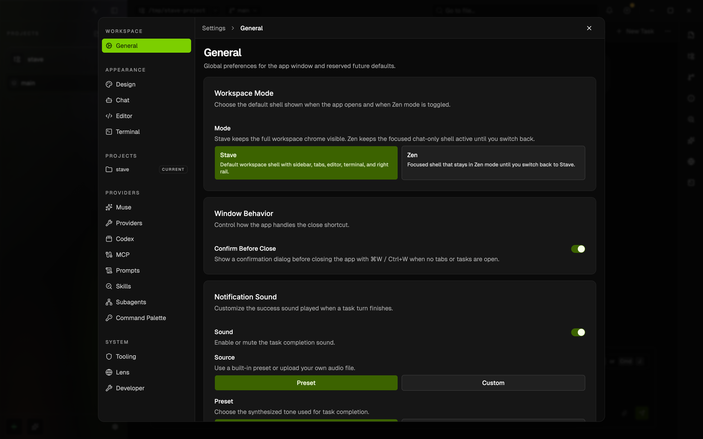

# Zen Mode

## Summary

- Zen mode hides most surrounding workspace chrome so the window can focus on the current chat, prompt composer, and final results.
- It also suppresses assistant thinking and execution-trace detail, switches the chat transcript and composer to a monospace treatment, and leaves only a minimal project list in the left rail.

This rendered example shows the `Settings → General` workspace mode control where users can keep the full Stave shell or stay in Zen by default.

## When To Use It

- Use it when you want to read or write in the current task without sidebar, editor, tabs, terminal, or right-rail noise.
- Use it during long review or implementation sessions when reasoning traces are distracting.
- Exit Zen mode if you need to switch tasks, inspect files, use the right rail, or interact with broader workspace controls.

## Before You Start

- Zen mode works best when you already have the target task selected.
- The underlying sidebar, editor, and right-rail state is preserved; Zen mode only hides it temporarily.

## Quick Start

1. Open the task you want to focus on.
2. Press `Cmd/Ctrl+K`, release, then press `Z`.
3. Press the same shortcut again to exit Zen mode.

## Interface Walkthrough

### Entry Points

- Keyboard shortcut: `Cmd/Ctrl+K`, then `Z`
- Command Palette: `Enter Zen Mode` or `Exit Zen Mode`
- Settings: `Settings → General → Workspace Mode`

### Key Controls

- Zen mode hides the top bar, task tabs, editor panels, terminal dock, right rail, and Stave Muse widget.
- A reduced left rail remains visible with only the current and recent project list.
- Assistant thinking, orchestration, subagent progress, and other trace detail are suppressed.
- Final assistant responses, changed-file results, approval cards, and user-input cards remain visible.
- The composer removes the usual model/runtime toggles, shows branch/worktree status above the prompt, and uses a terminal-style monospace layout.
- The composer sits on an opaque bottom dock with a soft top fade so transcript lines visually disappear underneath the input instead of ending abruptly.
- The transcript uses terminal-like `USER` / `AGENT` markers and a darker, thinner Zen-only scrollbar treatment.

## Common Workflows

### Enter A Focused Review Session

1. Open the task whose results you want to inspect.
2. Toggle Zen mode with `Cmd/Ctrl+K`, then `Z`.
3. Read the assistant response and changed-file results without leaving the chat surface.

### Exit Back To The Full Workspace

1. Press `Cmd/Ctrl+K`, then `Z` again.
2. The sidebar, editor, tabs, and terminal return in their previous state.

## Files And Data

- Zen mode is stored in local app settings as the current workspace mode.
- Choosing `Zen` in Settings keeps the app in Zen mode across restarts until you switch back to `Stave`.
- It does not change project files, workspace metadata, or task message history.

## Limitations And Advanced Options

- Zen mode intentionally hides file search and workspace navigation chrome while active.
- If you need to switch tasks or open another panel, exit Zen mode first or use the Command Palette.

## Troubleshooting

### I Cannot See Thinking Or Tool Trace Details

- Symptom: assistant reasoning and execution trace cards disappear in Zen mode.
- Cause: Zen mode suppresses non-result assistant trace UI by design.
- Fix: exit Zen mode with `Cmd/Ctrl+K`, then `Z`.

### I Need The Sidebar Or Editor Again

- Symptom: workspace chrome is hidden.
- Cause: Zen mode is active.
- Fix: toggle Zen mode off with `Cmd/Ctrl+K`, then `Z`.

## Related Docs

- [Command Palette](command-palette.md)
- [Project Instructions](project-instructions.md)
- [Keyboard shortcut guide in-app](../ui/project-workspace-task-shell.md)
